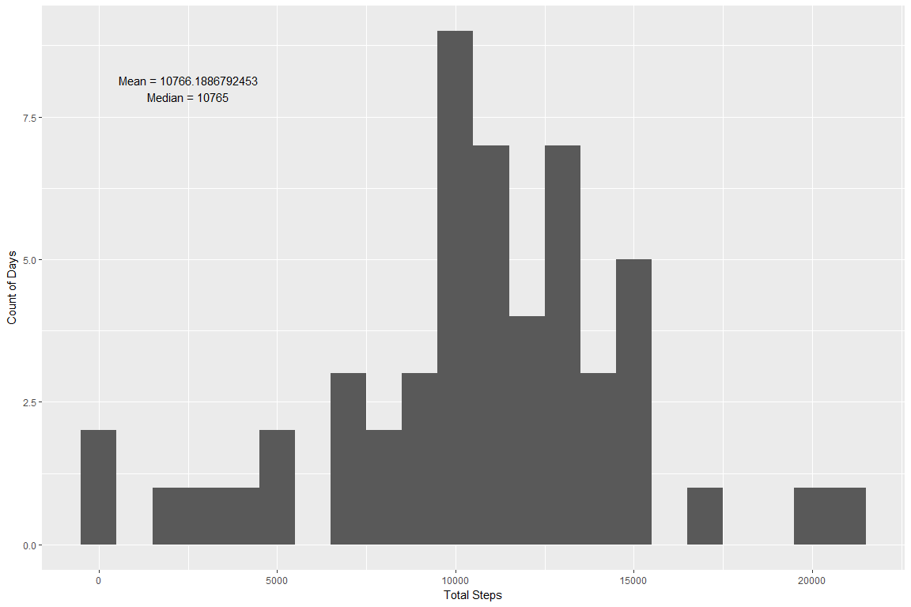
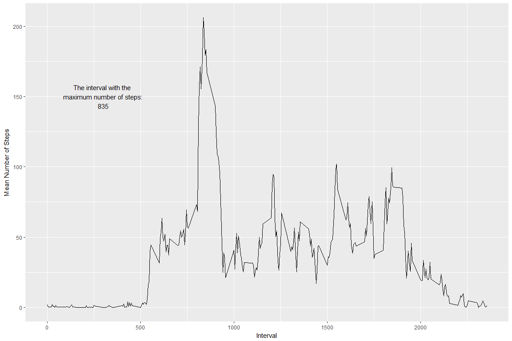

Reproducible Research - Course Project 1
================
Chad Koziel
February 15, 2018

R Markdown
----------

This is an R Markdown document for Course Project 1 from Reproducible Research.

### Loading and preprocessing the data

``` r
data_temp <- tempfile()
download.file(
     "https://d396qusza40orc.cloudfront.net/repdata%2Fdata%2Factivity.zip",
     data_temp
)

steps_raw <- read.csv(unz(data_temp, "activity.csv"))
unlink(data_temp)

steps_raw$date <- as.Date(steps_raw$date, format = "%Y-%m-%d")
```

### Mean total number of steps taken per day

``` r
steps_total_day <- steps_raw %>%
     group_by(date) %>%
     summarize(total_steps = sum(steps)) %>%
     filter(!is.na(total_steps))

annotation_text1 <-
     paste(paste("Mean = ", mean(steps_total_day$total_steps), sep = ""),
           paste("Median = ", median(steps_total_day$total_steps), sep = ""),
           sep = "\n")

ggplot(data = steps_total_day, aes(steps_total_day$total_steps)) +
     geom_histogram(binwidth = 1000) +
     labs(x = "Total Steps", y = "Count of Days") +
     annotate("text",
              x = 2500,
              y = 8,
              label = annotation_text1)
```



### What is the average daily activity pattern?

``` r
steps_mean_interval <- steps_raw %>%
     filter(!is.na(steps)) %>%
     group_by(interval) %>%
     summarize(mean_steps = mean(steps))

annotation_text2 <-
     paste("The interval with the ",
           "maximum number of steps:",
           steps_mean_interval[[which.max(steps_mean_interval$mean_steps), 1]],
           sep = "\n")

ggplot(data = steps_mean_interval, aes(x = interval, y = mean_steps)) +
     geom_line() +
     labs(x = "Interval", y = "Mean Number of Steps") +
     annotate("text",
              x = 300,
              y = 150,
              label = annotation_text2)
```



### Imputing missing values

Imputing missing values via the mean of the interval.

``` r
steps_imputed <- steps_raw %>%
     left_join(by = "interval", steps_mean_interval) %>%
     mutate(steps = as.integer(ifelse(is.na(steps), mean_steps, steps))) %>%
     mutate(dataset = "Imputed")
     
steps_total_day_imputed <- steps_imputed %>%
     group_by(date, dataset) %>%
     summarize(total_steps = sum(steps)) %>%
     select(date, total_steps, dataset)
     
     
raw_imputed_summary <-
     data.frame(c("Mean", "Median", "Std.Dev."),
     c(
     mean(steps_total_day_imputed$total_steps),
     median(steps_total_day_imputed$total_steps),
     sd(steps_total_day_imputed$total_steps)
     ),
     c(
     mean(steps_total_day$total_steps),
     median(steps_total_day$total_steps),
     sd(steps_total_day$total_steps)
     ))
     
colnames(raw_imputed_summary) <- c("Statistic", "Imputed", "Raw")
     
     ggplot(data = steps_total_day_imputed, aes(x = steps_total_day_imputed$total_steps)) +
     geom_histogram() +
     labs(x = "Total Steps", y = "Count of Days")
```

    ## `stat_bin()` using `bins = 30`. Pick better value with `binwidth`.

 The below table shows that the imputed mean and median are slightly lower than in the raw data. This implies that missing data were disproportionately from intervals where activity was lower.

The standard deviation of the imputed data, however, is significantly lower, as we would expect because imputation added more "mean" data.

``` r
raw_imputed_summary
```

    ##   Statistic   Imputed      Raw
    ## 1      Mean 10749.770 10766.19
    ## 2    Median 10641.000 10765.00
    ## 3  Std.Dev.  3974.619  4269.18

### Differences between weekdays and weekends

``` r
steps_interval_imputed <- steps_imputed %>%
     mutate(day_type = ifelse(
          weekdays(date) == "Saturday" |
               weekdays(date) == "Sunday",
          "Weekend",
          "Weekday"
     )) %>%
     group_by(interval, day_type) %>%
     summarize(mean_steps = mean(steps))

ggplot(data = steps_interval_imputed, aes(x = interval, y = mean_steps)) +
     geom_line() +
     facet_grid(day_type ~ .) +
     labs(x = "Interval", y = "Mean Steps")
```


